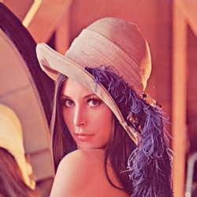

# MIMG Image Processing Examples

This gallery showcases various image processing modifiers available in mimg.

All examples are generated from the original `lena.png` image.

*Special thanks to Lena Söderberg, whose iconic photograph has been a cornerstone of image processing research for decades.*

## Original Image


## Individual Modifiers

### Invert

Invert all colors


### Grayscale

Convert to grayscale


### Brightness +50

Increase brightness


### Brightness -30

Decrease brightness


### Contrast 1.5

Increase contrast


### Contrast 0.7

Decrease contrast


### Saturation 1.5

Increase saturation


### Saturation 0.5

Decrease saturation


### Gamma 2.2

Apply gamma correction (brighter)


### Gamma 0.45

Apply gamma correction (darker)


### Sepia

Apply sepia tone effect


### Blur

Apply box blur with kernel size 3


### Sharpen

Sharpen the image


### Gaussian Blur

Apply Gaussian blur with sigma 2.0


### Emboss

Apply emboss effect


### Vignette

Apply vignette effect


### Posterize

Reduce to 8 color levels


### Hue Shift

Shift hue by 60 degrees


### Median Filter

Apply 3x3 median filter


### Flip Horizontal

Mirror horizontally



### Flip Vertical

Mirror vertically


### Rotate 45°

Rotate 45 degrees clockwise


### Resize

Resize to 200x200


### Crop

Crop to center 200x200


## Modifier Combinations

### Grayscale + Sepia

Vintage effect


### Brightness + Contrast + Sharpen

Enhanced image


### Saturation + Gamma

Color corrected


### Blur + Sharpen

Noise reduction with detail enhancement


### Sepia + Brightness

Warm vintage tone


### Gaussian Blur + Emboss

Soft emboss effect


### Vignette + Posterize

Vintage poster effect


### Hue Shift + Saturation

Color transformation


## Usage Examples

```bash
# Apply single modifier
mimg image.png sepia --output sepia_image.png

# Chain multiple modifiers
mimg image.png brightness 20 contrast 1.2 sharpen --output enhanced.png

# Generate this gallery
zig build gallery
```

## Available Modifiers

| Modifier | Description | Parameters |
|----------|-------------|------------|
| invert | Invert colors | None |
| grayscale | Convert to grayscale | None |
| brightness | Adjust brightness | value (-128 to 127) |
| contrast | Adjust contrast | factor (float) |
| saturation | Adjust saturation | factor (float) |
| gamma | Apply gamma correction | value (float) |
| sepia | Apply sepia tone | None |
| blur | Apply box blur | kernel_size (odd integer) |
| sharpen | Sharpen image | None |
| flip | Flip horizontally/vertically | direction |
| rotate | Rotate by angle | degrees (float) |
| resize | Resize image | width height |
| crop | Crop image | x y width height |
