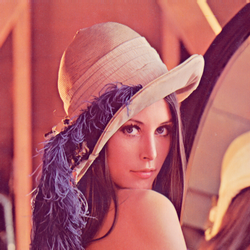
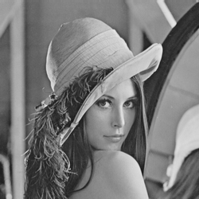
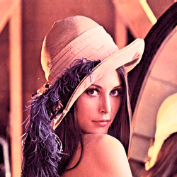
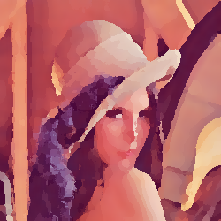

# 🎨 MIMG Gallery

Visual showcase of all available image processing modifiers.

*All examples generated from the standard `lena.png` test image. For complete documentation, see the [main README](../../README.md).*

---

## Original Image

---

## Individual Modifiers

### Invert

Invert all colors

### Grayscale

Convert to grayscale

### Brightness +50

Increase brightness

### Brightness -30

Decrease brightness

### Contrast 1.5

Increase contrast

### Contrast 0.7

Decrease contrast

### Saturation 1.5

Increase saturation

### Saturation 0.5

Decrease saturation

### Gamma 2.2

Apply gamma correction (brighter)

### Gamma 0.45

Apply gamma correction (darker)

### Sepia

Apply sepia tone effect

### Blur

Apply box blur with kernel size 3

### Sharpen

Sharpen the image

### Gaussian Blur

Apply Gaussian blur with sigma 2.0

### Emboss

Apply emboss effect

### Vignette

Apply vignette effect

### Posterize

Reduce to 8 color levels

### Hue Shift

Shift hue by 15 degrees

### Median Filter

Apply 3x3 median filter

### Threshold

Convert to pure black and white

### Solarize

Solarize effect with threshold

### Edge Detect

Detect edges using Sobel operator

### Pixelate

Apply pixelation effect

### Noise

Add random noise to image

### Exposure +1

Increase exposure by 1 EV

### Exposure -1

Decrease exposure by 1 EV

### Vibrance

Boost vibrance (smart saturation)

### Equalize

Histogram equalization for contrast

### Colorize Blue

Tint with blue color

### Duotone

Purple to yellow duotone effect

### Oil Painting

Artistic oil painting effect

### Flip Horizontal

Mirror horizontally

### Flip Vertical

Mirror vertically

### Rotate 45°

Rotate 45 degrees clockwise

### Resize

Resize to 200x200

### Crop

Crop to center 200x200

---

## Creative Combinations

### Data Augmentation

Flip + brightness variation for ML training data

### Geometric Augmentation

Rotation + crop for dataset variety

### Vintage Portrait

Sepia tone with vignette for classic look

### Color Grading

Brightness + saturation for natural enhancement

### Detail Enhancement

Contrast boost + sharpening for crisp images

### Noise Reduction

Gaussian blur + median filter pipeline

### Graphic Art

Posterize + emboss for artistic rendering

### Monitor Calibration

Gamma correction + contrast adjustment

### Stylized Edges

Edge detection + posterize for graphic novel style

### Retro Game

Pixelate + posterize for retro gaming aesthetic

### Film Grain

Solarize + noise for vintage film look

### HDR Look

Equalize + vibrance for HDR-style enhancement

### Dreamy Portrait

Oil painting + vibrance for soft romantic look

### Cinematic Grade

Duotone + exposure for film-like color

---

  <i>Generated automatically by <code>zig build gallery</code></i> 
  <i>See <a href="../../README.md">README.md</a> for full documentation and usage examples</i>

